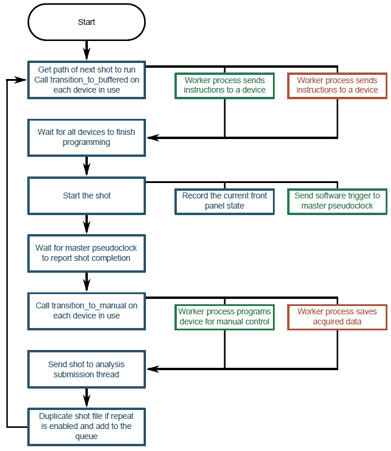
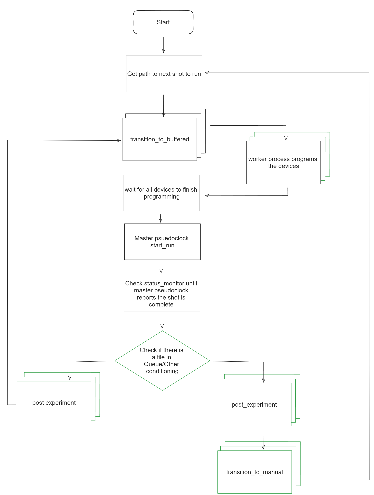

# the _labscript suite_ » blacs

### Graphical interface to scientific instruments and experiment supervision

[](https://github.com/labscript-suite/blacs/actions)
[](https://github.com/labscript-suite/blacs/raw/master/LICENSE.txt)
[](https://python.org)
[](https://pypi.org/project/blacs)
[](https://anaconda.org/labscript-suite/blacs)
[](https://groups.google.com/forum/#!forum/labscriptsuite)
<!--[](https://doi.org/10.1063/1.4817213)-->


**blacs** supervises the execution of experiments controlled by the [*labscript suite*](https://github.com/labscript-suite/labscript-suite). It manages experiment queuing and hardware-timed execution, and provides manual control over devices between experiment shots.


## My Fork

This fork aims to optimize the performance of BLACS by reducing the overhead between the execution of experimental shots, particularly when we want to process a large sequence. While the labscript suite is very well-developed, user-friendly, and supports all general workflows, optimizing this specific workflow can significantly improve efficiency during high-throughput experimental sequence runs.

The key areas of BLACS identified for potential improvements are:

1. State Machine: Streamlining state transitions to minimize latency.
2. Reliance on QT Main Thread: Reducing dependency on the main thread to prevent bottlenecks.
3. Worker Processes: Enhancing the efficiency of worker processes to better handle concurrent tasks.

The following sections provide a detailed motivation for these changes, describe the current implementations, and outline the proposed optimizations.

## 1. State Machine

The first bottleneck occurs during the transition to the `manual mode` state at the end of each shot (Figure 1). `Manual mode` allows the user to provide manual control over devices between experiment shots. The problem arises when there are multiple shots in the queue, in which case after the `transition_to_manual` we immediately call `transition_to_buffered` negating the need for manual contro. It is clear that this transition is unnecessary when shots are queued.

However, it is not as simple as removing the `transition_to_manual` when it is not needed due to the fact that `transition_to_manual` is a "compound" state transition - it has multiple functionalities. It is responsible for post-processing experiment data (saving acquired data, images, etc.), updating internal flags/variables of the device, and programming the devices to operate in manual mode.

Testing revealed that the manual mode programming of devices (initiating manual mode tasks via driver calls) was the most time-consuming aspect in some cases.

<p align="center">
  
  <br>
  <b>Figure 1:</b> Original BLACS State Machine flow (https://docs.labscriptsuite.org/projects/blacs/en/latest/shot-management/)
</p>

### Proposed solution
Introduce a new post_experiment state responsible for all functionalities required at the end of a shot. Consequently, transition_to_manual will solely handle setting up manual mode on the devices.

As discussed, since manual mode device operation is unnecessary between queued shots, we can skip transition_to_manual in such cases (Figure 2).

<p align="center">
  
  <br>
  <b>Figure 2:</b> New BLACS State Machine flow to skip manual mode when shots are queued up.
</p>

#### Notes

* Most devices do not have costly manual mode task setup calls; only the NI-6363 acquisition worker in our setup exhibited a setup time greater than 30ms.
* In general, `transition_to_manual` should be called any time it is possible for the user to actually control the devices. We call currently `transition_to_manual` when there are no shots in the queue or the queue is paused. 
* To adapt your device to the new state machine flow, update all your device workers. Start by renaming your `transition_to_manual` function to `post_experiment` and then add an empty `transition_to_manual`. You can then decide what functionality belongs in `post_experiment` and what can be moved to `transition_to_manual` to optimize the worker transition after each shot.

#### Backwards Compatibility

Fallback to `transition_to_manual` state function execution if `post_experiment` is not implemented in device workers.

## 2. QT Main Thread

Almost all functionality is queued for execution on the QT Main Thread. The developers likely did this for two reasons:

* To ensure all GUI modifications occur on a single thread.
* To serialize operations on a single thread, maintaining the thread safety of non-GUI objects (e.g., StateQueue).

Scheduling everything on a single thread introduces non-negligble context switching overhead. Many functions scheduled with `inmain` do not interact with the GUI or non-thread-safe objects, causing unnecessary delays in their execution. This scheduling delay results in approximately 20-30ms of slowdown for each shot.

```
2024-06-04 17:02:47,100 DEBUG BLACS.ni_6363.mainloop: Processing event _transition_to_buffered
2024-06-04 17:02:47,109 DEBUG BLACS.pb.mainloop: Processing event _transition_to_buffered
2024-06-04 17:02:47,110 DEBUG BLACS.ni_6363.mainloop: Instructing worker main_worker to do job _transition_to_buffered
2024-06-04 17:02:47,114 DEBUG BLACS.ni_6363_main_worker.worker: Got job request _transition_to_buffered
2024-06-04 17:02:47,115 DEBUG BLACS.ni_6363_main_worker.worker: Starting job _transition_to_buffered
2024-06-04 17:02:47,126 DEBUG BLACS.pb.mainloop: Instructing worker main_worker to do job _transition_to_buffered
```
* The `ni_6363.mainloop` schedules the generator function on the MainThread after line 1. We see an unnecessary 10ms delay while the generator is scheduled and executed before and we can start the `ni_6363_main_worker` process.
* The `pb.mainloop` is not able to start until the generator executes on the MainThread since the `StateQueue.get` must also occur on the MainThread. It is clear we are not maximizing the concurrency of our program.  

### Proposed Solution

I removed the `inmain` decorators allowing function execution from various threads such as the `DeviceTab.mainloop`s and `ExperimentQueue.manager`. To address the developers' concerns I have made the following changes:
* Added fine-grain locks for the QT Application GUI. Instead of scheduling an entire function that has one line that modifies the GUI on the MainThread, we now grab the QTlock before making any GUI update.
* Implemented a thread-safe Single-Consumer Multi-Producer StateQueue object using local locks.

Here is an example of the log prints after the change 
```
2024-06-30 11:34:09,607 DEBUG BLACS.pb.mainloop: Processing event _transition_to_buffered
2024-06-30 11:34:09,607 DEBUG BLACS.ni_6363.mainloop: Processing event _transition_to_buffered
2024-06-30 11:34:09,607 DEBUG BLACS.pb.mainloop: Instructing worker main_worker to do job _transition_to_buffered
2024-06-30 11:34:09,607 DEBUG BLACS.pb_main_worker.worker: Got job request _transition_to_buffered
2024-06-30 11:34:09,607 DEBUG BLACS.pb_main_worker.worker: Starting job _transition_to_buffered
2024-06-30 11:34:09,607 DEBUG BLACS.ni_6363.mainloop: Instructing worker main_worker to do job _transition_to_buffered
2024-06-30 11:34:09,607 DEBUG BLACS.ni_6363_main_worker.worker: Got job request _transition_to_buffered
2024-06-30 11:34:09,607 DEBUG BLACS.ni_6363_main_worker.worker: Starting job _transition_to_buffered
```
* the `transition_to_buffered` worker processes is launched as soon as we recieve the event.
* the `pb.mainloop` and `ni_6363.mainloop` are able to execute concurrently. 

## 3. Worker Processes

For devices with multiple workers, tasks are processed serially. We grab a single worker task at a time from the yield in the State GUI generator function, execute the worker, pass back the results, and receive the next worker task if there is one. I have not found a reason for these workers to be serialized.

### Proposed Solution

The DeviceTab.mainloop that processes the State GUI generator function now expects to receive a list of all worker tasks (Figure 2). These tasks are then scheduled simultaneously, and the results of each worker are returned in a list.

This change means the worker processing time is no longer the sum of all workers' times but is instead bound by the longest worker's processing time.

#### Backwards Compatibility

Fallback to accepting a single worker task at a time if the State GUI generator function does not follow the new API.

## 4. Other Performance Hacks

1. Avoid Unnecessary h5 File Access
    * At the start of a shot, the device list associated with the current h5 file is retrieved. This step is unnecessary when all shots use the same devices.

2. Minimize Unnecessary GUI Updates
    * The BLACS GUI is quite verbose, attempting to update as much information as possible for the user. GUI updates can only be done serially and are quite slow, especially when updating a large amount of information in a short time. Reducing these updates saves considerable time.


## Results

Overall, these changes reduce the overhead between shots in our experimental setup from **380ms to 220ms**. With additional performance hacks, the overhead is closer to **170ms**.

It should be noted that the impact of some optimizations is specific to the experimental setup and the hardware/functionalities being used. For example, if you have no devices with multiple workers, the worker parallelization change will not affect you. Therefore, you may not see the same level of improvement I achieved when applying these optimizations to your experiment.

## Things I am looking into (performance or otherwise)

- **Plugin Implementation for "Sequence Device-List"**: To properly address the optimization in section 4.1, allowing users to define the devices for their experimental sequence. 
- **DeviceTab for Remote Operation**: Developing a DeviceTab for remote control of pre-existing experiment control GUI software (e.g., LabVIEW laser locking, Laser Raster software). Should be a lot more convenient compared to re-creating the GUI in a BLACS tab.
- Fast Visualization of Experiment Data: Creating a quick method to visualize raw or lightly-processed experiment data (e.g., analog input graphs) between shots.
  - A faster alternative to Lyse, which can lag behind in fast repetition rate executions.
  - Aimed at providing immediate feedback to experimenters during prototyping, with no requirement to save the data.
  
If you have any thoughts/concerns or ideas for additional features please feel free to open an issue or contact me directly at haques24@mit.edu.

## Usage

To install this fork, follow the same procedure as for the BLACS developer installation. Please refer to the Installation section for details.

This fork is designed to work out of the box, thanks to the backward compatibility integrated into all my changes. You should see performance improvements using the master branch of the fork. Any necessary changes would be to the devices and state functions not already modified. New devices should implement the `post_experiment` state task in their workers as described in section 1. Additionally, state generator functions should be updated to pass all worker tasks simultaneously.

Further performance improvements can be achieved using the performance_hacks branch, but it may require some additional modifications to function correctly. Comments have been added to facilitate this process.

## Disclaimer
My changes have not been thoroughly tested across a broad range of experimental hardware or workflows. I appreciate your help in testing these changes and welcome any bug reports! 

Please reach out to me if you require any help integrating my fork into your setup

## Installation
blacs is distributed as a Python package on [PyPI](https://pypi.org/user/labscript-suite) and [Anaconda Cloud](https://anaconda.org/labscript-suite), and should be installed with other components of the _labscript suite_. Please see the [installation guide](https://docs.labscriptsuite.org/en/latest/installation) for details.
